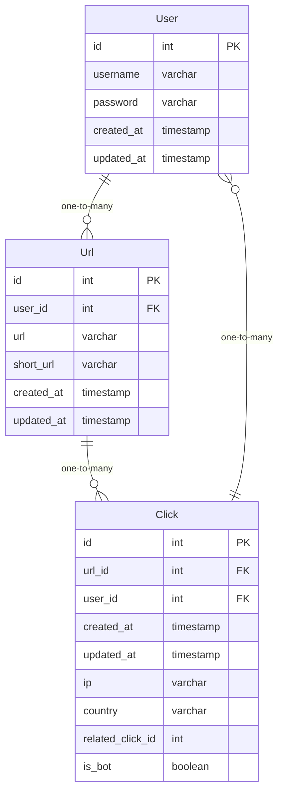

### Golang Project for Students (An Url Shortener)

#### Introduction

This is a simple project for students to learn Golang. It is a url shortener. It is a simple project for students to learn Golang. It is a url shortener.

#### Schema

### Step-by-Step Development Video
1. Create folder structure (Work in Progress)

### Step-by-Step Development Doc
1. [Create folder structure](steps/step1.md) (Completed 👍)
2. [Create domain model](steps/step2.md)
3. [Create repository interface](steps/step3.md)
4. [Create repository implementation](steps/step4.md)
5. [Create repository test](steps/step5.md)
6. [Create dockerfile and docker-compose](steps/step6.md)
7. [Insert redis and postgres into docker-compose](steps/step7.md)
8. [Create logger](steps/step8.md)
9. [Create service interface](steps/step9.md)
10. [Create service implementation](steps/step10.md)
11. [Create service test](steps/step11.md)
12. [Create router & handlers](steps/step12.md)
13. [Create user authentication](steps/step13.md)
14. [Create user authentication test](steps/step14.md)
15. [Create user authentication handler](steps/step15.md)
16. [CI/CD with Github Actions](steps/step16.md)