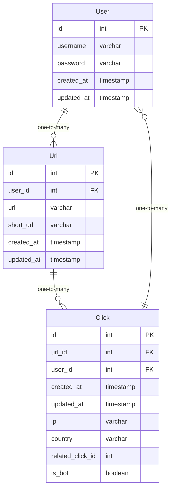

### Öğrenciler İçin Golang Projesi (URL Kısaltıcı)

İngilizce döküman için [buraya](README.md) tıklayın.

#### Giriş

Bu, öğrencilerin Golang öğrenmek için kullanabilecekleri basit bir projedir. URL kısaltıcıdır.

#### Şema

### Adım Adım Geliştirme Videosu

1. Klasör yapısını oluştur (Devam Ediyor)

### Adım Adım Geliştirme Dökümanı

1. [Klasör yapısını oluştur](steps/tr/step1.md) (Tamamlandı 👍)
2. [Domain modelini oluştur](steps/tr/step2.md)
3. [Repository interface'ini oluştur](steps/tr/step3.md)
4. [Repository implementation'ını oluştur](steps/tr/step4.md)
5. [Repository testini oluştur](steps/tr/step5.md)
6. [Dockerfile ve docker-compose'ı oluştur](steps/tr/step6.md)
7. [Redis ve Postgres'i docker-compose'a ekleyin](steps/tr/step7.md)
8. [Logger'ı oluştur](steps/tr/step8.md)
9. [Service interface'ini oluştur](steps/tr/step9.md)
10. [Service implementation'ını oluştur](steps/tr/step10.md)
11. [Service testini oluştur](steps/tr/step11.md)
12. [Router ve handlers'ı oluştur](steps/tr/step12.md)
13. [Kullanıcı kimliğini doğrula](steps/tr/step13.md)
14. [Kullanıcı kimliğini doğrulama testini oluştur](steps/tr/step14.md)

### Adım Adım Geliştirme Videosu
1. Klasör yapısını oluştur (Devam Ediyor)

### Step-by-Step Development Doc
1. [Klasör yapısını oluşturma (Tamamlandı 👍)](steps/tr/step1.md)
2. [Domain model oluşturma](steps/tr/step2.md)
3. [Depo arabirimini oluşturma](steps/tr/step3.md)
4. [Depo uygulamasını oluşturma](steps/tr/step4.md)
5. [Depo testi oluşturma](steps/tr/step5.md)
6. [Dockerfile ve docker-compose oluşturma](steps/tr/step6.md)
7. [Redis ve Postgres'i docker-compose'a ekleyin](steps/tr/step7.md)
8. [Günlük dosyası oluşturma](steps/tr/step8.md)
9. [Hizmet arabirimini oluşturma](steps/tr/step9.md)
10. [ Hizmet uygulamasını oluşturma](steps/tr/step10.md)
11. [ Hizmet testi oluşturma](steps/tr/step11.md)
12. [ Yönlendirici ve işleyicileri oluşturma](steps/tr/step12.md)
13. [ Kullanıcı doğrulama oluşturma](steps/tr/step13.md)
14. [ Kullanıcı doğrulama testi oluşturma](steps/tr/step14.md)
15. [ Kullanıcı doğrulama işleyicisi oluşturma](steps/tr/step15.md)
16. [ Github Actions ile CI/CD](steps/tr/step16.md)

